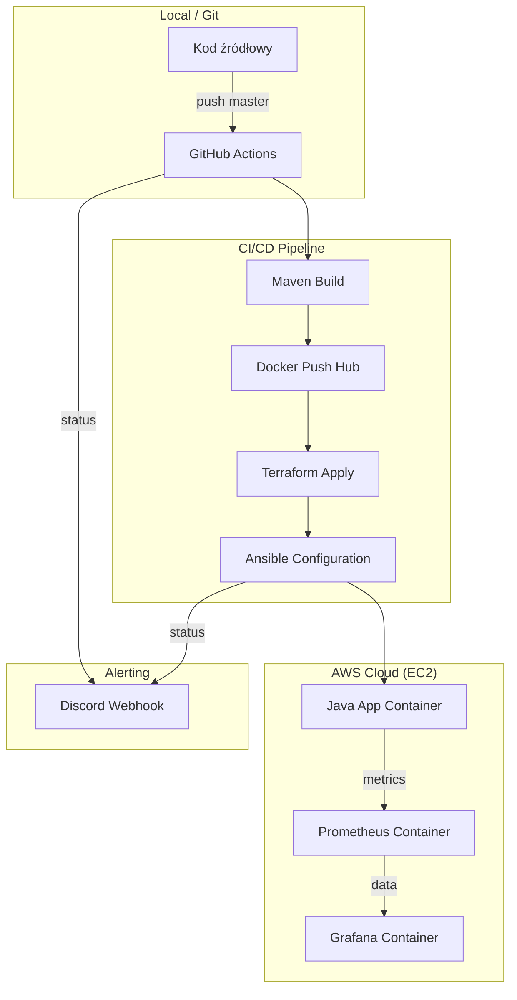

# 🚀 Spring Boot DevOps Deployment: AWS + Terraform + Ansible + CI/CD

Niniejszy projekt stanowi kompletną realizację systemu automatycznego wdrożenia i monitorowania aplikacji mikroserwisowej w chmurze AWS. Projekt został przygotowany jako realizacja celów dyplomowych w zakresie inżynierii DevOps, spełniając wszystkie wymagania techniczne dotyczące automatyzacji, konteneryzacji i monitoringu.

## 📋 Główne Cele Projektu (Zrealizowane)

- [x] **Automatyzacja Infrastruktury (IaC):** Pełny provisioning zasobów AWS za pomocą Terraform.
- [x] **Automatyzacja CI/CD:** Wykorzystanie GitHub Actions do budowania, testowania i wdrażania.
- [x] **Konteneryzacja:** Pełna konteneryzacja aplikacji oraz stosu monitoringu (Docker & Docker Compose).
- [x] **Monitoring:** Wdrożenie stosu Prometheus + Grafana z wizualizacją metryk JVM (Dashboard 4701).
- [x] **Powiadomienia:** Integracja z Discord Webhooks dla statusów każdego etapu Pipeline'u.

---

## 🛠 Stos Technologiczny

| Kategoria | Narzędzie | Opis |
| :--- | :--- | :--- |
| **Aplikacja** | Java 21 / Spring Boot | Backend z wystawionymi metrykami Actuator/Prometheus. |
| **Infrastruktura** | Terraform | Zarządzanie VPC, EC2, S3 (Remote State) i Security Groups. |
| **Konfiguracja** | Ansible | Automatyczna instalacja środowiska Docker i deployment kontenerów. |
| **CI/CD** | GitHub Actions | Automatyzacja procesów Build -> Push -> Provision -> Deploy. |
| **Monitoring** | Prometheus & Grafana | Zbieranie danych (scraping) i wizualizacja parametrów JVM. |
| **Komunikacja** | Discord | Powiadomienia w czasie rzeczywistym o wyniku wdrożenia. |

---

## 🏗 Architektura Systemu

## ⚙️ Kluczowe Funkcjonalności

### 1. Infrastruktura jako Kod (IaC)
Zastosowano **idempotentne** podejście do tworzenia zasobów, co pozwala na wielokrotne uruchamianie skryptów bez błędów.

* **S3 Backend:** Plik stanu `.tfstate` jest przechowywany w chmurze **AWS S3**, zapewniając spójność infrastruktury i bezpieczeństwo danych o zasobach.
* **Selective Destruction:** Skonfigurowany workflow niszczenia instancji AWS (`terraform destroy -target`) pozwala na selektywne usuwanie płatnych zasobów (**EC2**) przy jednoczesnym zachowaniu kluczy SSH i S3 Bucket.

### 2. Proces CI/CD (GitHub Actions)
Pipeline został zaprojektowany zgodnie z najlepszymi praktykami automatyzacji:

* **Build & Push:** Automatyczne budowanie artefaktu **JAR** (Maven) i obrazu **Docker**, który jest przesyłany do repozytorium **Docker Hub**.
* **Infrastructure Provisioning:** Dynamiczne tworzenie sieci **VPC**, podsieci oraz instancji **EC2** z automatycznym przypisaniem odpowiednich reguł **Security Groups**.
* **Deployment:** **Ansible** łączy się z nowo utworzonym adresem IP, instaluje niezbędne pakiety (Docker) i uruchamia stos usług poprzez `docker-compose.yml`.

### 3. Monitoring i Observability
System monitoringu został wdrożony jako integralna część infrastruktury:

* **Spring Boot Actuator:** Aplikacja wystawia metryki w formacie Prometheus pod dedykowanym endpointem `/actuator/prometheus`.
* **Docker Volumes:** Zastosowano **trwałe wolumeny** dla Grafany, dzięki czemu Dashboardy i konfiguracja Data Source nie znikają po restarcie lub podmianie kontenerów.
* **Wizualizacja:** Zaimportowano profesjonalny Dashboard (**ID: 4701**) do szczegółowego monitorowania stanu maszyny wirtualnej **JVM** (Heap Memory, Garbage Collection, CPU Usage).

---

## 🚀 Instrukcja Uruchomienia

### Konfiguracja GitHub Secrets
W ustawieniach repozytorium (`Settings > Secrets and variables > Actions`) należy dodać następujące wpisy:

* `AWS_ACCESS_KEY_ID` / `AWS_SECRET_ACCESS_KEY` – poświadczenia dostępu do AWS.
* `DOCKERHUB_USERNAME` / `DOCKERHUB_TOKEN` – dane logowania do rejestru obrazów.
* `DISCORD_WEBHOOK` – URL do kanału powiadomień.
* `AWS_SSH_KEY_CONTENT` – zawartość klucza prywatnego (** .pem **).
* `TF_VAR_KEY_NAME` / `TF_VAR_PUBLIC_KEY` – nazwa i treść klucza publicznego zarejestrowanego w AWS.

### Wyzwalanie procesów
1.  **Wdrożenie:** Każdy `git push` na branch **master** uruchamia pełny, zautomatyzowany proces deploymentu.
2.  **Usuwanie:** Manualne uruchomienie workflow **Infrastructure Destruction** z zakładki **Actions** pozwala na bezpieczne i selektywne usunięcie infrastruktury.

---
